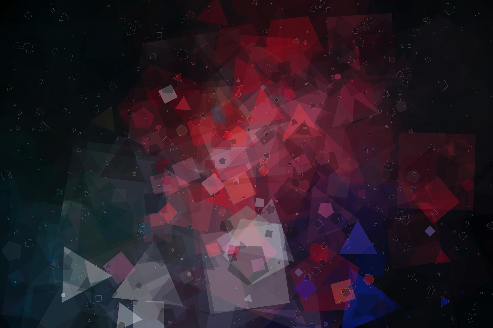

# Generative Art

This is my personal project for making Generative Art.

## Installation

There are three ways of getting the binary. You can either download from the [releases page,](https://github.com/chilipepperhott/generative-art/releases) or, if you have `cargo` installed, you can run:

```bash
cargo install --git https://github.com/chilipepperhott/generative-art generative-art
```

You can also run the program inside of [WebAssembly.sh](https://webassembly.sh/). Read 

## WebAssembly.sh

If you want to run the command-line app in the browser, here is what you can do:

1) Download `generative-art.wasm` from the [releases page,](https://github.com/chilipepperhott/generative-art/releases).

2) [WebAssembly.sh]([WebAssembly.sh](https://webassembly.sh/)) in your browser. Chromium based browsers tend to work better.

3) Drag `generative-art.wasm` over the webpage and drop it. This loads the program.

4) That's it! Now you can use `generative-art <subcommand>` inside the browser the same way you would use it locally. If you want to use `preslav` you can use the same process as Step 3 to add photos to terminal. If you want to download a generated image, just use `download <filename>`.

## Structure

There are two crates: 

* generative-art: algorithms for generation.
* ga-web: a web interface for the project. You can try it out on [my website](https://elijahpotter.dev/art).

### Generative art

Right now, there are just two generators:

* Preslav: the Rust implementation of Preslav Rachev's book *Generative Art in Go*.
* Celestial: simulates and renders the motion of celestial objects.



